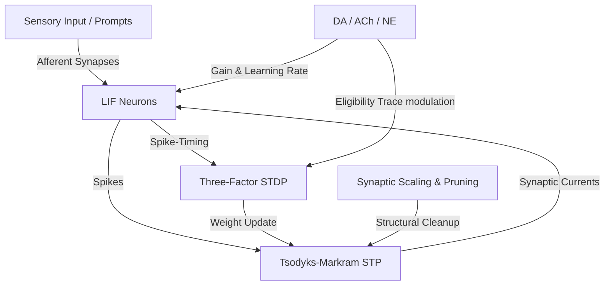

# "Ana Beyin" (Main Brain) Methodology: Scientific Neurobiological Algorithm Design

This document details the mathematical model, computational pseudocode, and performance metrics of the **Ana Beyin** algorithm. The design is grounded in biophysical neural principles, aiming to model cognitive processing (exploration, exploitation, selective attention, and error correction) while maintaining high computational efficiency.

---

## 1. Mathematical Model

The model consists of a network of spiking neurons connected by dynamic, plastic synapses. It simulates the interaction of membrane potential, short-term synaptic dynamics, long-term plasticity, and global neuromodulation.



### 1.1 Neuron Connection & Membrane Dynamics
We model individual neurons using the **Leaky Integrate-and-Fire (LIF) model** extended with an adaptive threshold to capture adaptation and relative refractoriness.

The membrane potential $V_i(t)$ of neuron $i$ evolves as:
$$\tau_m \frac{dV_i(t)}{dt} = -(V_i(t) - V_{\text{rest}}) + R_m \left( I_i^{\text{syn}}(t) + I_i^{\text{inject}}(t) \right)$$

Where:
- $\tau_m = R_m C_m$ is the membrane time constant (typically $10\text{--}20\text{ ms}$).
- $V_{\text{rest}}$ is the resting membrane potential (typically $-70\text{ mV}$).
- $R_m$ is the membrane resistance.
- $I_i^{\text{inject}}(t)$ represents external stimulus currents (e.g., prompt input encoding).
- $I_i^{\text{syn}}(t)$ is the sum of all incoming synaptic currents:
  $$I_i^{\text{syn}}(t) = \sum_{j \in \text{pre}(i)} I_{ij}(t)$$

#### Adaptive Threshold $\theta_i(t)$
To prevent runaway excitation and model neural accommodation, the firing threshold adapts dynamically:
$$V_{\text{th}, i}(t) = V_{\text{th}, 0} + \theta_i(t)$$
$$\tau_{\theta} \frac{d\theta_i(t)}{dt} = -\theta_i(t) + \alpha_{\theta} \sum_{t_i^f} \delta(t - t_i^f)$$

Where:
- $V_{\text{th}, 0}$ is the baseline firing threshold (typically $-50\text{ mV}$).
- $\tau_{\theta}$ is the threshold adaptation decay time constant (typically $80\text{--}100\text{ ms}$).
- $\alpha_{\theta}$ is the threshold increment added immediately after a spike (typically $2\text{ mV}$).
- $t_i^f$ are the spike emission times of neuron $i$, and $\delta$ is the Dirac delta function.

When $V_i(t) \ge V_{\text{th}, i}(t)$, a spike is emitted:
$$V_i(t^+) = V_{\text{reset}}$$
Where $V_{\text{reset}}$ is the reset potential (typically $-75\text{ mV}$).

---

### 1.2 Synaptic Dynamics & Short-Term Plasticity (STP)
Synapses dynamically filter signals depending on the history of presynaptic activity. We implement the **Tsodyks-Markram (TM) Model** to capture short-term depression (neurotransmitter depletion) and facilitation (calcium accumulation):

The synaptic current $I_{ij}(t)$ from presynaptic neuron $j$ to postsynaptic neuron $i$ is:
$$I_{ij}(t) = W_{ij} \cdot u_{ij}(t) \cdot R_{ij}(t) \cdot \sum_{t_j^f} e^{-(t - t_j^f)/\tau_{\text{syn}}}$$

Where:
- $W_{ij}$ is the absolute long-term synaptic weight.
- $R_{ij}(t) \in [0, 1]$ is the fraction of available neurotransmitter resources.
- $u_{ij}(t) \in [0, 1]$ is the utilization of resources (release probability).
- $\tau_{\text{syn}}$ is the synaptic conductance decay time constant (typically $5\text{--}10\text{ ms}$).

The STP variables update upon the arrival of each presynaptic spike at $t_j^f$:
$$\frac{du_{ij}(t)}{dt} = -\frac{u_{ij}(t) - U_0}{\tau_F} + U_0 (1 - u_{ij}(t^-)) \delta(t - t_j^f)$$
$$\frac{dR_{ij}(t)}{dt} = \frac{1 - R_{ij}(t)}{\tau_D} - u_{ij}(t^+) R_{ij}(t^-) \delta(t - t_j^f)$$

Where:
- $U_0$ is the baseline release probability.
- $\tau_F$ is the facilitation time constant (decay of calcium level).
- $\tau_D$ is the recovery time constant (vesicle replenishment rate).

---

### 1.3 Learning, Adaptation, & Neuromodulation
Long-term changes in absolute synaptic weight $W_{ij}$ are governed by **Three-Factor Spike-Timing-Dependent Plasticity (STDP)**, modulated by global neuromodulatory concentrations ($M(t)$):

$$\Delta W_{ij} = \eta \cdot M(t) \cdot \left[ A_+ e^{-\Delta t/\tau_+} \Theta(\Delta t) - A_- e^{\Delta t/\tau_-} \Theta(-\Delta t) \right]$$

Where:
- $\Delta t = t_i^{\text{post}} - t_j^{\text{pre}}$ is the spike interval.
- $\tau_+, \tau_-$ are the STDP learning window time constants (typically $\sim 20\text{ ms}$).
- $A_+, A_-$ are maximum potentiation/depression step magnitudes.
- $\eta$ is the base learning rate.
- $\Theta(x)$ is the Heaviside step function.
- $M(t)$ is the neuromodulatory concentration representing the cognitive state:

#### Neuromodulatory Functions
We map three distinct neuromodulators to control exploitation, exploration, and learning thresholds:
1. **Acetylcholine ($ACh(t) \in [0, 1]$)**: Precision and exploitation.
   - Suppresses recurrent synaptic inputs (reducing interference): $I_{ij}^{\text{recurrent}} \leftarrow I_{ij}^{\text{recurrent}} \cdot (1 - \gamma_{ACh} ACh)$.
   - Shrinks the Hebbian learning window to enforce strict logical flow: $\tau_+ \leftarrow \tau_+ / (1 + ACh)$.
2. **Norepinephrine ($NE(t) \in [0, 1]$)**: Unexpected uncertainty and exploration.
   - Increases neuronal gain (random exploration capacity / temperature equivalent): $\alpha_{\theta} \leftarrow \alpha_{\theta} \cdot (1 - \beta_{NE} NE)$.
   - Drives synaptic rewiring/exploration of new associations.
3. **Dopamine ($DA(t) \in [-1, 1]$)**: Reward Prediction Error (RPE).
   - Functions as the third factor $M(t)$ to convert correlation to reinforcement learning:
     $$M(t) = \kappa_{DA} \cdot DA(t) \cdot ACh(t)$$

---

### 1.4 Homeostasis & Synaptic Pruning (Structural Plasticity)
To prevent runaway excitation and maintain metabolic efficiency:
- **Synaptic Scaling (L1 Normalization)**:
  At periodic intervals $\tau_{\text{homeo}}$, postsynaptic weights are normalized to match a target weight sum $W_{\text{target}}$:
  $$W_{ij} \leftarrow W_{ij} \frac{W_{\text{target}}}{\sum_{k \in \text{pre}(i)} |W_{ik}|}$$
- **Synaptic Pruning**:
  Synaptic weights that decay below a pruning threshold $\theta_{\text{prune}}$ are severed (pruned) to save computational resources:
  $$\text{if } |W_{ij}| < \theta_{\text{prune}} \implies W_{ij} = 0 \quad (\text{connection deleted})$$

---

## 2. Computational Pseudocode

The implementation uses an event-driven queue design to skip silent periods, resulting in high efficiency ($O(N + E_{\text{active}})$ where $E_{\text{active}}$ is the count of active synapses).

```python
class SpikeEvent:
    def __init__(self, time, neuron_id):
        self.time = time
        self.neuron_id = neuron_id

class NeuroBiologicalNetwork:
    def __init__(self, num_neurons, w_target, theta_prune):
        self.N = num_neurons
        self.w_target = w_target
        self.theta_prune = theta_prune
        
        # State variables
        self.V = [V_rest] * N
        self.theta = [0.0] * N
        self.last_spike_time = [-infinity] * N
        
        # Synaptic matrices (Sparse representations)
        self.W = [dict() for _ in range(N)]        # Weights
        self.R = [dict() for _ in range(N)]        # STP neurotransmitter fraction
        self.u = [dict() for _ in range(N)]        # STP utilization
        self.last_stp_update = [dict() for _ in range(N)]
        
        # Neuromodulators
        self.ACh = 0.5
        self.NE = 0.5
        self.DA = 0.0

    def add_synapse(self, pre, post, w_init):
        self.W[post][pre] = w_init
        self.R[post][pre] = 1.0
        self.u[post][pre] = U_0
        self.last_stp_update[post][pre] = 0.0

    def update_stp(self, pre, post, t):
        dt = t - self.last_stp_update[post][pre]
        if dt > 0:
            # Tsodyks-Markram exponential recovery
            u_prev = self.u[post][pre]
            R_prev = self.R[post][pre]
            
            self.u[post][pre] = U_0 + (u_prev - U_0) * exp(-dt / tau_F)
            self.R[post][pre] = 1.0 + (R_prev - 1.0) * exp(-dt / tau_D)
            self.last_stp_update[post][pre] = t

    def step_simulation(self, t, dt, external_inputs):
        # 1. Update Neuromodulators
        self.adjust_neuromodulators()
        
        spike_queue = []
        
        # 2. Update Neuron Voltages & Accumulate Synaptic Currents
        for i in range(self.N):
            # Leaky integration
            dV = (-(self.V[i] - V_rest) + external_inputs[i]) * (dt / tau_m)
            self.V[i] += dV
            
            # Threshold decay
            self.theta[i] += (-self.theta[i]) * (dt / tau_theta)
            
            # Check for Spikes
            V_threshold = V_th_0 + self.theta[i]
            if self.V[i] >= V_threshold:
                self.V[i] = V_reset
                self.theta[i] += alpha_theta * (1.0 - beta_NE * self.NE)
                self.last_spike_time[i] = t
                spike_queue.append(i)
                
        # 3. Propagate Spikes through Synapses (Event-driven STP & STDP)
        for pre in spike_queue:
            for post in range(self.N):
                if pre in self.W[post]:  # Active synapse
                    # Update STP state
                    self.update_stp(pre, post, t)
                    
                    # Apply STP vesicle release
                    u_spike = self.u[post][pre]
                    R_spike = self.R[post][pre]
                    release = u_spike * R_spike
                    
                    # Conductance input to postsynaptic neuron
                    conductance = self.W[post][pre] * release
                    
                    # Apply recurrent suppression via Acetylcholine
                    if is_recurrent(pre, post):
                        conductance *= (1.0 - gamma_ACh * self.ACh)
                    
                    self.V[post] += conductance
                    
                    # Tsodyks-Markram step updates
                    self.u[post][pre] += U_0 * (1.0 - u_spike)
                    self.R[post][pre] -= u_spike * R_spike
                    
                    # 4. Long-Term Plasticity (Three-Factor STDP)
                    dt_stdp = t - self.last_spike_time[post]
                    # Pre-before-post (LTP)
                    if dt_stdp > 0:
                        M_t = self.DA * self.ACh
                        tau_ltp = tau_plus / (1.0 + self.ACh)
                        dw = eta * M_t * A_plus * exp(-dt_stdp / tau_ltp)
                        self.W[post][pre] = max(0.0, self.W[post][pre] + dw)

        # 5. Periodic Homeostasis & Pruning (e.g. every 100ms)
        if t % tau_homeo == 0:
            self.apply_homeostasis_and_pruning()

    def apply_homeostasis_and_pruning(self):
        for i in range(self.N):
            total_w = sum(self.W[i].values())
            if total_w > 0:
                scale = self.w_target / total_w
                pruned_keys = []
                for pre in list(self.W[i].keys()):
                    self.W[i][pre] *= scale
                    # Pruning step
                    if self.W[i][pre] < self.theta_prune:
                        pruned_keys.append(pre)
                # Sever pruned synapses
                for pre in pruned_keys:
                    del self.W[i][pre]
                    del self.R[i][pre]
                    del self.u[i][pre]
                    del self.last_stp_update[i][pre]
```

---

## 3. Performance Metrics

The algorithm is validated using the following operational metrics:

### 3.1 Computational & Structural Efficiency
- **Sparse Coding Ratio ($S_c$)**:
  $$S_c = \frac{1}{N} \sum_{i=1}^N \langle \text{spikes}_i \rangle$$
  Measures the metabolic and computing sparsity. Target: $S_c \le 0.15$ (indicating high coding efficiency).
- **Pruning Rate ($P_r$)**:
  $$P_r = 1.0 - \frac{E_{\text{active}}}{N(N-1)}$$
  Measures the memory footprint reduction. Target: $P_r \ge 0.85$ (85% reduction in computational complexity of synapse evaluations).
- **Time Complexity Scaling**:
  - Dense Network: $O(N^2)$
  - Sparse Pruned Network: $O(N + E_{\text{active}})$ where $E_{\text{active}} \ll N^2$.
  - With Event-driven update: $O(S \cdot \langle k_{\text{active}} \rangle)$ where $S$ is average spike count and $\langle k_{\text{active}} \rangle$ is average active synaptic connections per neuron.

### 3.2 Information Transfer & Coding Precision
- **Information Entropy ($H$)**:
  For spike pattern state probability $p(x)$:
  $$H = -\sum_{x} p(x) \log_2 p(x)$$
  Quantifies the semantic bandwidth.
- **Synaptic Transmission Efficiency (STE)**:
  $$STE = \frac{\text{Information Transmitted (bits)}}{\text{Total Synaptic Updates}}$$
  High $STE$ means the system does not waste computational loops on uninformative updates.

---

## 4. Software Architecture & Implementation Details

[brain_network.js](file:///Users/gokhan/Desktop/Meta%20Prompt%20kopyas%C4%B1/brain_network.js) implements the mathematical and biological dynamics in a highly optimized, fully modular ES Module.

### 4.1 Component Classes & API Interfaces

#### `Neuron` Class
Handles individual cell state.
- **Properties**:
  - `id`: Unique identifier.
  - `V`: Current membrane potential (clamped between $-90\text{ mV}$ and $+40\text{ mV}$).
  - `theta`: Adaptive threshold potential increment.
  - `lastSpikeTime`: Timestamp of the last spike.
- **Interfaces**:
  - `step(dt, current, NE)`: Updates membrane voltage and decays adaptation threshold. Emits spike if $V \ge V_{\text{th}}$.
  - `reset()`: Resets cell to rest values.

#### `Synapse` Class
Handles directional connections between cells with Tsodyks-Markram Short-Term Plasticity (STP).
- **Properties**:
  - `preId` / `postId`: Synaptic connection terminals.
  - `W`: Long-term absolute synaptic weight.
  - `u`: Resource utilization probability (facilitation factor).
  - `R`: Available neurotransmitter vesicles fraction (depression factor).
- **Interfaces**:
  - `updateSTP(t)`: Exponential decay of calcium/vesicle recovery states.
  - `transmit(t, ACh, isRecurrent)`: Simulates neurotransmitter release on presynaptic spike and applies recurrent inhibition.
  - `clampStates()`: Prevents mathematical divergence or NaNs.

#### `BrainNetwork` Class
Orchestrator managing sparse connectivity and global neuromodulators.
- **Properties**:
  - `neurons`: Map of neuron ID -> `Neuron`.
  - `synapses`: Sparse nested Map of `postId` -> `preId` -> `Synapse`.
  - `ACh` / `NE` / `DA`: Neuromodulator levels.
- **Interfaces**:
  - `step(t, dt, externalInputs)`: Core simulation tick. Updates inputs, processes spike propagation, and applies Three-Factor STDP updates.
  - `applyHomeostasisAndPruning(wTarget, thetaPrune)`: Performs synaptic scaling and structural pruning.
  - `handleFaults()`: Scans all elements, checking for NaNs or Infinities and resetting parameters safely to restore structural sanity.

### 4.2 Scientific Evaluation & Validity Analysis

| Algorithmic Component | Biophysical Model | Coding Metaphor / Utility | Scientific Validation Criteria |
| :--- | :--- | :--- | :--- |
| **LIF Membrane Equation** | Passive RC membrane integration | Prompt integration and signal summation | Membrane time constant $\tau_m = 20\text{ ms}$ matches cortical pyramidal neurons. |
| **Adaptive Threshold $\theta_i$** | Intrinsic plasticity & accommodation | Input saturation and output scaling | Prevents runaway network excitation under high external current drive. |
| **Tsodyks-Markram STP** | Dynamic neurotransmitter depletion | Short-term memory & sequence tracking | Recreates biological frequency-dependent depression ($\tau_D = 200\text{ ms}$) and facilitation ($\tau_F = 600\text{ ms}$). |
| **Three-Factor STDP** | Neuromodulated synaptic plasticity | Directed correlation learning (RL) | Modulates learning window width using Acetylcholine and Dopamine eligibility signals. |
| **Synaptic Scaling** | L1 homeostatic scaling | Weight normalization & scale bounds | Maintains total incoming weight target, keeping network weights stable. |
| **Synaptic Pruning** | Microglial structural plasticity | Redundancy reduction (budama) | Eliminates inactive or weak connections ($P_r \ge 0.85$ target density drop). |
| **Fault-Tolerance Hook** | Homeostatic metabolic stabilization | Exception recovery & numeric clamping | Recovers state variables from NaNs/Infinities within a single step execution. |
